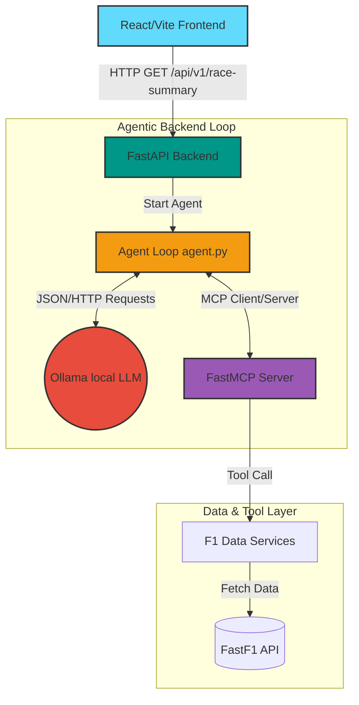

# F1 Agentic Analyst Dashboard

Welcome to the F1 Agentic Analyst! This project uses an autonomous Large Language Model (LLM) loop connected to live Formula 1 data. Users can request a comprehensive, engineering-focused race report, and a local LLM will dig into lap-by-lap telemetry, track status, tire stints, and overtakes to generate accurate and insightful summaries.

## 🏗 System Architecture

The overarching system is composed of several decoupled layers. By using the **Model Context Protocol (MCP)**, the project gives an LLM the ability to query F1 telemetry exactly like a human data engineer.



### 1. Frontend (`/frontend`)
- **Framework**: React via Vite.
- **Purpose**: Provides a rich user interface (F1 Race Dashboard) to display driver standings, lap traces, and top 3 finishers. It contains an "Analyze Race" trigger which waits on the backend to execute the agentic workflow.

### 2. API Gateway (`/f1-ai-analyst/main.py`)
- **Framework**: FastAPI
- **Purpose**: Serves as the entry point for the frontend, orchestrating data retrieval.
  - `/api/v1/dashboard-data`: Synchronously returns processed dataframe telemetry for plotting.
  - `/api/v1/race-summary`: Asynchronously spins up the Agent loop.

### 3. Agent Orchestrator (`/f1-ai-analyst/app/agent.py`)
- **Technology**: `mcp.client.stdio` and standard HTTP requests.
- **Purpose**: Initialises an MCP Client linked to our locally running MCP server via Standard I/O. It feeds the exposed tools into an LLM via Ollama and loops contextually. When the LLM decides it needs an F1 telemetry tool, the agent intercepts the requested `tool_call`, pushes it to the MCP Server, and injects the result back into the LLM context.

### 4. FastMCP Server (`/f1-ai-analyst/app/mcp_server.py`)
- **Technology**: FastMCP (`mcp.server.fastmcp`)
- **Purpose**: Decouples the raw F1 data processing from the agent code. It exposes specialized tools as formal schemas:
  - `get_race_overview`: Baselines the podium and facts.
  - `get_lap_events_slice`: Contextualises overtakes and incidents within lap bounds.
  - `get_track_status`: Evaluates Safety Cars and VSCs.
  - `get_driver_stints`: Computes tire strategy loops.
  - `get_telemetry_summary`: Fetches specific micro-telemetry on braking/throttle behaviors.

### 5. F1 Data Services (`/f1-ai-analyst/app/services`)
- **Technology**: `fastf1` library wrapped in an `F1RaceAnalyzer` class.
- **Purpose**: Handles downloading, caching, and reshaping raw telemetry chunks into readable formats for the MCP Server to deliver.

## 🚀 Getting Started

### Prerequisites
- Python 3.12+ (managed via `uv`)
- Node.js (v18+)
- Local LLM Runner (e.g. Ollama with `minimax-m2.7:cloud` or your model of choice).

### Running the Backend
1. Navigate to the `f1-ai-analyst` directory.
2. Ensure you have dependencies installed (using `uv` or `pip`).
3. Run the development server:
   ```bash
   uv run main.py
   ```

### Running the Frontend
1. Navigate to the `frontend` directory.
2. Install NodeJS dependencies:
   ```bash
   npm install
   ```
3. Boot the Vite React server:
   ```bash
   npm run dev
   ```

## 🧠 Why the MCP?

If we were to pass a whole race's telemetry to an LLM, the context window would break due to the massive scale of points for every driver over thousands of meter slices. By adopting the **Model Context Protocol**, the LLM "paginates" through the race or queries only what it finds anomalous, dramatically increasing data accuracy and heavily reducing context limits.
