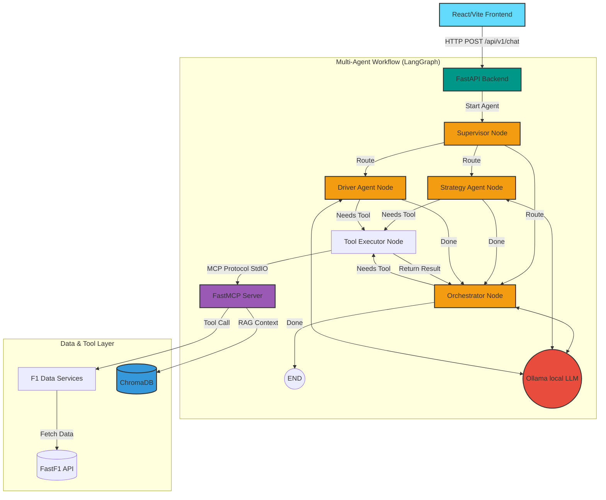

# F1 Agentic Analyst Dashboard

Welcome to the F1 Agentic Analyst! This project uses an autonomous Large Language Model (LLM) multi-agent workflow connected to live Formula 1 data. Users can request a comprehensive, engineering-focused race report or chat interactively. A local LLM will dig into lap-by-lap telemetry, track status, tire stints, and overtakes to generate accurate and insightful summaries.

## 🏗 System Architecture

The overarching system is composed of several decoupled layers. By using the **Model Context Protocol (MCP)** and **LangGraph**, the project gives an LLM the ability to query F1 telemetry exactly like a human data engineer.



### 1. Frontend (`/frontend`)
- **Framework**: React via Vite.
- **Purpose**: Provides a rich user interface (F1 Race Dashboard) with a persistent chat widget. Users can ask specific questions about F1 strategy, past races, or driver stats, and wait on the backend to execute the multi-agent workflow.

### 2. API Gateway (`/backend/main.py`)
- **Framework**: FastAPI
- **Purpose**: Serves as the entry point for the frontend, orchestrating data retrieval and triggering the LangGraph agent loop via `/api/v1/chat` and `/api/v1/race-summary`.

### 3. Agent Orchestrator (`/backend/app/agent.py`)
- **Technology**: `mcp.client.stdio`, LangGraph, LangChain, and standard HTTP requests.
- **Purpose**: Implements a Multi-Agent architecture. A `Supervisor` routes queries to specialized agents (`Strategy Agent`, `Driver Performance Agent`) or the `Orchestrator`. It feeds the exposed tools into an LLM via Ollama and loops contextually. The agents intercept `tool_call` requests, push them to the MCP Server, and inject the results back into the LLM context.

### 4. FastMCP Server & RAG (`/backend/app/mcp_server.py` & ChromaDB)
- **Technology**: FastMCP (`mcp.server.fastmcp`) and ChromaDB
- **Purpose**: Decouples raw F1 data processing and context retrieval from the agent code. It exposes specialized tools:
  - `get_race_overview`, `get_lap_events_slice`, `get_track_status`, `get_driver_stints`, `get_telemetry_summary`
  - `query_historical_context` (Retrieval-Augmented Generation using ChromaDB)

### 5. F1 Data Services (`/backend/app/services`)
- **Technology**: `fastf1` library wrapped in an `F1RaceAnalyzer` class.
- **Purpose**: Handles downloading, caching, and reshaping raw telemetry chunks into readable formats for the MCP Server.

## 🚀 Getting Started

### Prerequisites
- Python 3.12+ (managed via `uv`)
- Node.js (v18+)
- Docker (for ChromaDB)
- Local LLM Runner (e.g. Ollama with `llama3.2` or your model of choice).

### Running the Infrastructure
1. Start the ChromaDB vector database using Docker Compose:
   ```bash
   docker-compose up -d vectordb
   ```
2. Navigate to the `backend` directory and run the data ingestion pipeline:
   ```bash
   uv run ingest_data.py
   ```

### Running the Backend
1. Navigate to the `backend` directory.
2. Ensure you have dependencies installed (using `uv`).
3. Run the development server:
   ```bash
   uv run main.py
   ```

### Running the Frontend
1. Navigate to the `frontend` directory.
2. Install NodeJS dependencies:
   ```bash
   npm install
   ```
3. Boot the Vite React server:
   ```bash
   npm run dev
   ```

## 🧠 Why MCP & LangGraph?

By adopting the **Model Context Protocol**, the LLM queries only what it finds anomalous, dramatically increasing data accuracy and heavily reducing context limits. Furthermore, **LangGraph** enables a multi-agent routing architecture, distributing complex reasoning across specialized agents (Strategy vs. Driver Performance) for more accurate insights.
