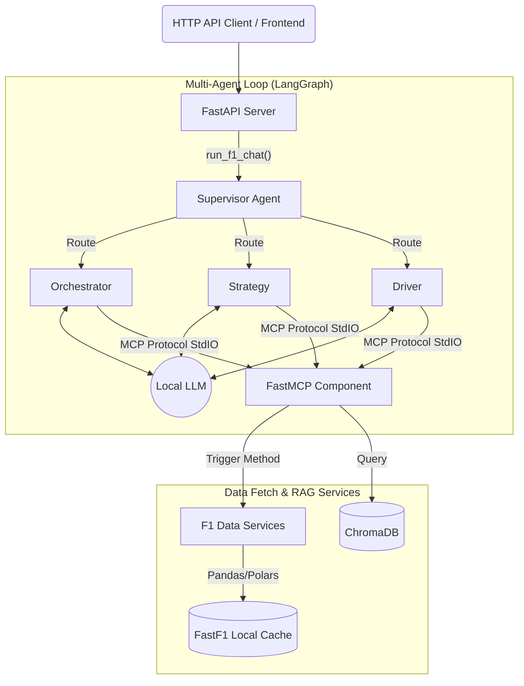

# F1 AI Analyst Backend

This is the backend for the F1 Agentic Analyst system. It provides the data extraction layer and an autonomous multi-agent LangGraph logic that writes lap-by-lap race narratives and answers chat queries.

## System Design

The backend is built using several decoupled pieces, communicating through the **Model Context Protocol (MCP)**. This handles extracting and passing Formula 1 data from the memory-heavy `fastf1` library to a locally running LLM without hitting context limits.

### Components

1. **FastAPI Routes (`app/api/routes.py`)**: The entry point block for triggering data fetching and autonomous report generation by clients, including the new `/api/v1/chat` endpoint.
2. **Analysis Agent Workflow (`app/agent.py`)**: Hooks an Ollama LLM to a `mcp.client.stdio` streaming connection using LangGraph. It features a Supervisor router and specialized sub-agents.
3. **FastMCP Server (`app/mcp_server.py`)**: Organizes the data services and RAG into strict, well-typed tools (e.g. `get_lap_events_slice`, `query_historical_context`).
4. **Data Service & Ingestion**:
    - **`app/services/data_service.py`**: Houses the `F1RaceAnalyzer` OOP class that isolates all the `fastf1` telemetry data manipulation.
    - **`ingest_data.py`**: Populates the local ChromaDB with F1 historical context for Retrieval-Augmented Generation (RAG).

See the README at the root of `F1_projects` for full frontend/full-stack system design context.
