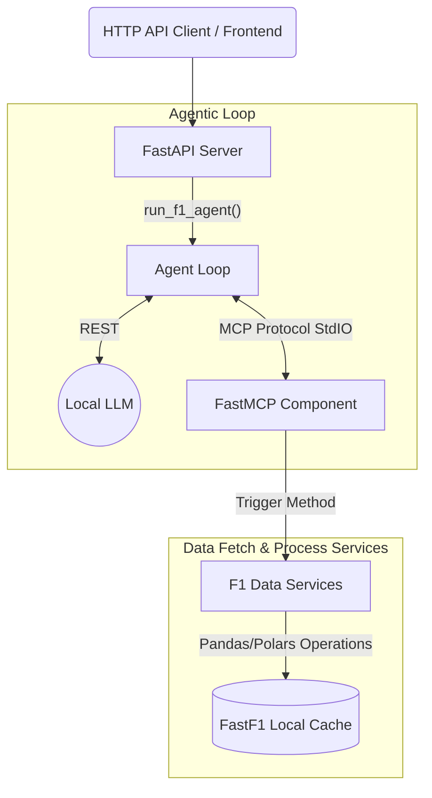

# F1 AI Analyst Backend

This is the backend for the F1 Agentic Analyst system. It provides the data extraction layer and an autonomous agent logic that writes lap-by-lap race narratives.

## System Design

The backend is built using several decoupled pieces, communicating through the **Model Context Protocol (MCP)**. This handles extracting and passing Formula 1 data from the memory-heavy `fastf1` library to a locally running LLM without hitting context limits.

### Components

1. **FastAPI Routes (`app/api/routes.py`)** The entry point block for triggering data fetching and autonomous report generation by clients.
2. **Analysis Agent (`app/agent.py`)** Hooks an Ollama LLM to a `mcp.client.stdio` streaming connection. 
3. **FastMCP Server (`app/mcp_server.py`)** Organizes the data services into strict, well-typed tools (e.g. `get_lap_events_slice`, `get_telemetry_summary`).
4. **Data Service (`app/services/data_service.py`)** Houses the `F1RaceAnalyzer` OOP class that isolates all the `fastf1` telemetry data manipulation and returns concise strings.

See the README at the root of `F1_projects` for full frontend/full-stack system design context.
